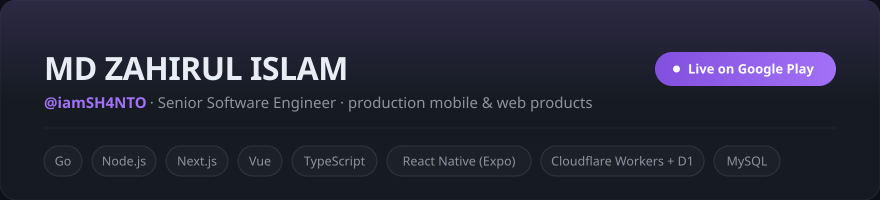
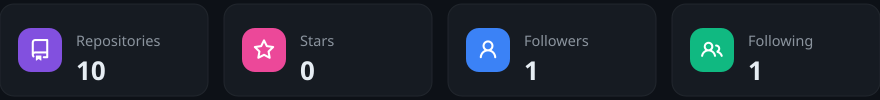
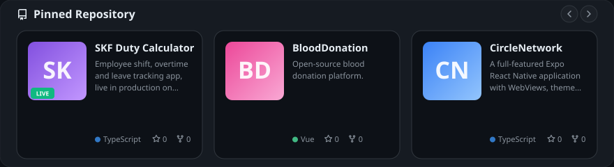
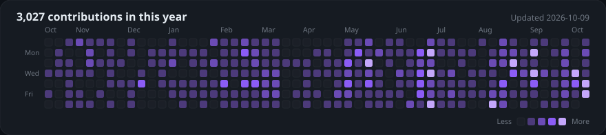

  

  

  

  

  
  
  
  
  
  
  
  

  <a href="https://github.com/iamSH4NTO">View activity →</a>

---

## About

I build practical software for real users: product landing pages, web dashboards, backend APIs, admin systems, automation tools, and mobile apps. My work spans Go, Node.js, Next.js, Vue.js, PHP, MySQL, TypeScript, and Expo React Native.

<table>
  <tr>
    <td><strong>Backend</strong></td>
    <td>Go, Node.js, PHP, REST APIs, authentication, integrations, scalable service logic</td>
  </tr>
  <tr>
    <td><strong>Frontend</strong></td>
    <td>Next.js, Vue.js, TypeScript, responsive dashboards, admin panels, product websites</td>
  </tr>
  <tr>
    <td><strong>Database</strong></td>
    <td>MySQL, PostgreSQL, MongoDB, data modeling, application persistence</td>
  </tr>
  <tr>
    <td><strong>Mobile</strong></td>
    <td>Production React Native (Expo) apps shipped to Google Play, plus WebView and native build work</td>
  </tr>
  <tr>
    <td><strong>Cloud</strong></td>
    <td>Cloudflare Workers, D1 (SQLite), serverless APIs, WebCrypto auth, deployment</td>
  </tr>
</table>

---

## Tech Stack

  

---

## Featured Work

| Project | Type | Stack | Role |
| --- | --- | --- | --- |
| [SKF Duty](https://play.google.com/store/apps/details?id=com.skf.duty) | Live production mobile app (Google Play) | React Native, Expo, TypeScript, Cloudflare Workers, Cloudflare D1 | Designed, built and shipped end-to-end by me |
| [24scan.com](https://24scan.com) | Personal product | Next.js landing, Go backend, Vue.js dashboard frontend | Built and maintained by me |
| [Tipster.ma](https://tipster.ma) | Company project | Node.js, Next.js | Built by me |
| [KickoffAPI](https://kickoffapi.com) | Company project | Node.js | Backend development |
| [OracaleAI](https://oracaleai.com) | Company project | Node.js | Built by me |
| [BloodDonation](https://github.com/iamSH4NTO/BloodDonation) | Open-source personal project | Go, Vue.js, Docker | Built and maintained by me |
| [CircleNetwork](https://github.com/iamSH4NTO/CircleNetwork) | Personal mobile app | Expo, React Native, TypeScript | Built and maintained by me |

---

## Public Projects

<table>
  <tr>
    <td width="33%">
      <h3>SKF Duty Calculator</h3>
      
Employee shift tracking and overtime calculation app, live in production on Google Play.

      
<a href="https://play.google.com/store/apps/details?id=com.skf.duty">View on Google Play</a>

    </td>
    <td width="33%">
      <h3>BloodDonation</h3>
      
Open-source blood donation platform built with Go, Vue.js, and Docker.

      
<a href="https://github.com/iamSH4NTO/BloodDonation">View Repository</a>

    </td>
    <td width="33%">
      <h3>CircleNetwork</h3>
      
Expo React Native mobile app with WebViews, file downloads, theme settings, and custom splash screen.

      
<a href="https://github.com/iamSH4NTO/CircleNetwork">View Repository</a>

    </td>
  </tr>
</table>

---

## Contact

  
  
  
  
  

  
  
  

  Building useful products, clean APIs, and reliable user experiences.

